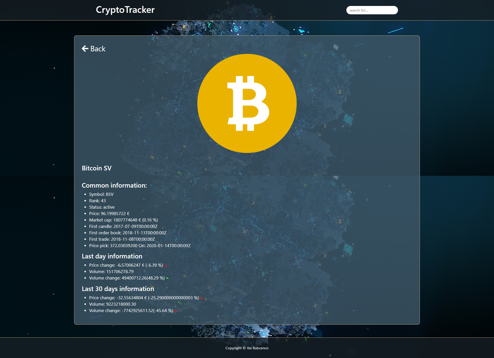

# CryptoTracker (Catalogue of Cryptocurrencies)

## Description

In this app I managed to display top 100 cryptocurrencies from the world sorted by their rank.
Also for convenient using it is possible to sort them by name and symbol using searching form on the top navbar.
It has a page for analyzing information about each cryptocurrency.

## Built With

- React
- Redux
- JavaScript
- HTML5/CSS3
- Bootstrap
- [nomics](https://nomics.com/) api

## Set up this projecect locally

- Open the terminal in the directory where you want to install the app;
- Run command `git clone git@github.com:iliebabcenco/crypto-tracker.git` which will clone the project;
- Switch to the main directory of project using cd;
- Run `npm install` in your computer terminal to install dependencies (you will need Node.js installed on your machine);
- Run `npm start` (you will need an internet browser installed on your machine);

## How it looks

### Main page
 
### Main page after searching
  
### Details page
 

## Testing

This project include 8 Test Suites with 27 tests and 12 snapshots.

The tests are written with Jest, and React testing library.

To run tests use:

`npm test`

### Deployment

This application is deployed on [Heroku](https://master-calc.herokuapp.com/).

## Authors

👤 **Ilie Babcenco**

  

## 🤝 Contributing

Contributions, issues, and feature requests are welcome!

If you want to contribute, you can clone this project or fork it.

If you found an issue, feel free to check the [issues page](https://github.com/iliebabcenco/crypto-tracker/issues).

## Show your support

Give a ⭐️ if you like this project!

## Acknowledgments

- [Microverse](https://www.microverse.org/)
- [Nomics](https://nomics.com/)
